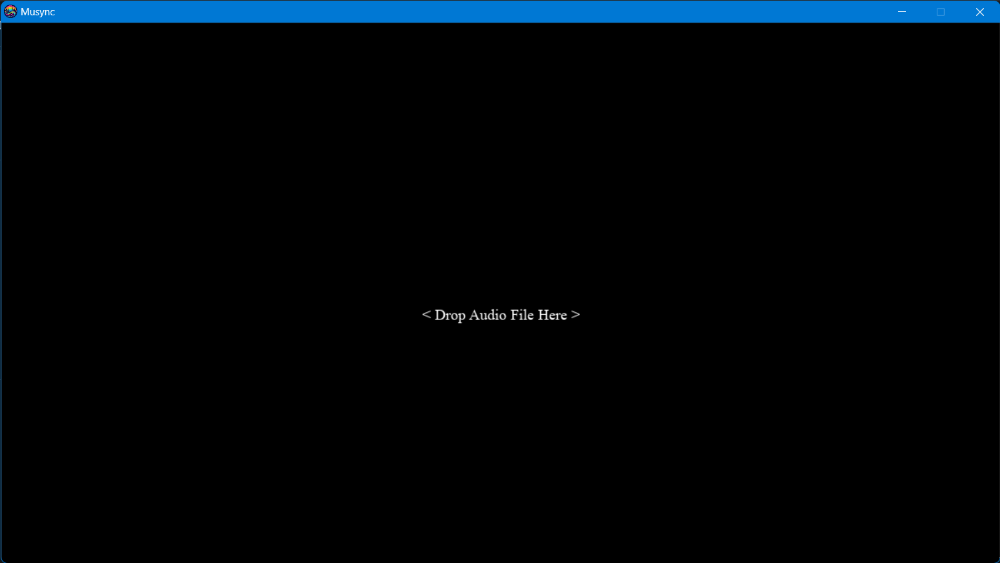
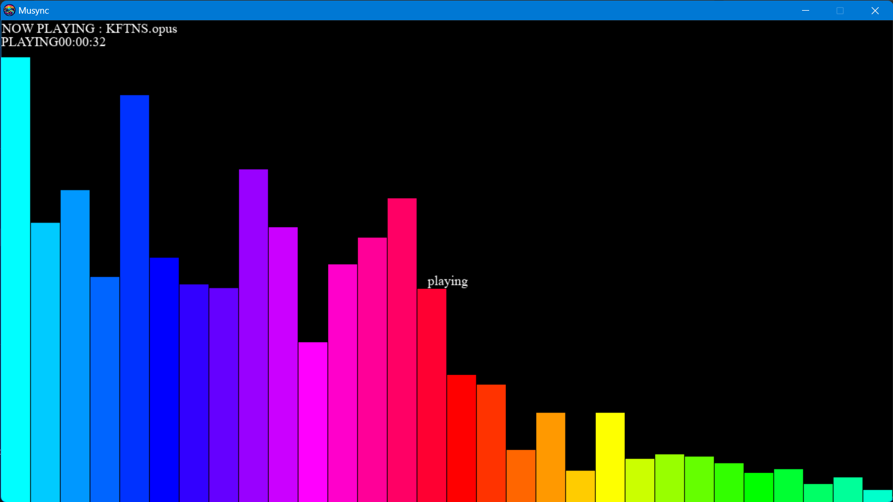

# MUSYNC
<hr>
<div align="center">
     
    <p>Music Visualizer in Python</p>
</div>

<hr>

## Language Used: 
<div align="center">

</div>

<hr>

## Libraries Used:
<div align="center">
     
    
    
    
</div>

<hr>

## About:
`Musync` is a simple Music Visualizer written in Python Programming Language made in order to enjoy some visuals along with casually played music. It supparts the feature of Drag-&-Drop audio file to play it. `Musync` is able to play an audio file if it is in any one of the following formats: (.wav, .mp3, .ogg, .flac, .opus, .m4a, .raw).
 
The script *musync.py* can be converted to an application using `auto-py-to-exe`.

<hr>

## Build Application:

make sure you have <a herf="https://ffmpeg.org/download.html">ffmpeg</a> installed in your system. 

and for necessary Python Libraries, simply run:
```
pip install -r requirements.txt
```

Now open terminal and run:

```
auto-py-to-exe
```

triggering a `Auto Py To Exe window`. To know more about the process visit <a href="https://pypi.org/project/auto-py-to-exe/">here</a>.

> in option Script Location : add path to `musync.py`

> in option Onefile : select One File

> in option Console Window: select Window Based (hide the console)

> in option Icon : add path to `icon.ico`

> in option Additional Files : add path to `logo.png`

> Click CONVERT .PY TO .EXE

after finishing an `output` folder will appear containing the  `musync.exe` application. Copy and add `logo.png` to this folder(`output`) also.

<hr>

## Musync in Action:
<div align="center">
     
    
</div>

<hr>

<u>Any suggestions, improvements, and feedback is welcome.</u>
